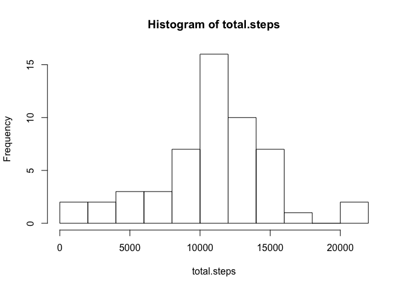
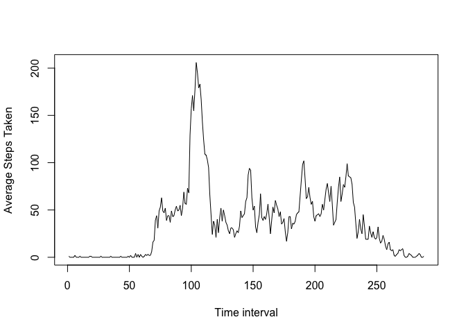
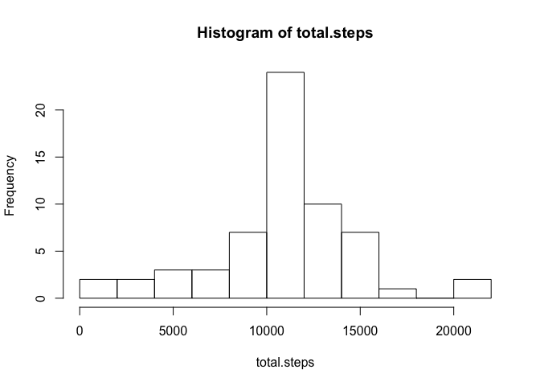
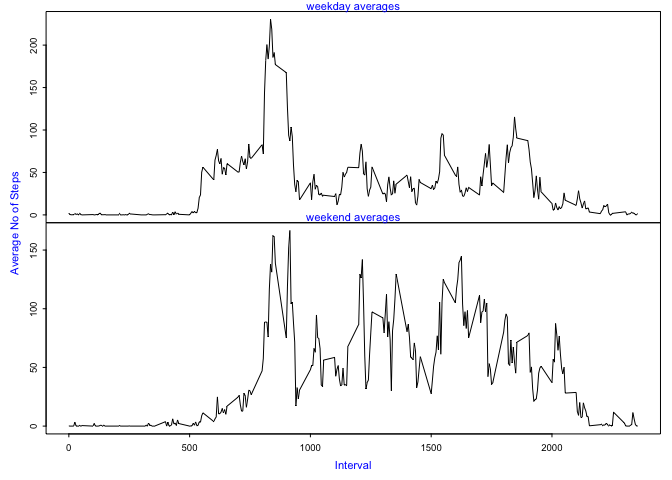

# Reproducible Research: Peer Assessment 1


## Loading and preprocessing the data

### Reading data
Following code reads the activity.csv file into a data frame called ad.frame

```r
ad.frame <- read.csv("activity.csv")
summary(ad.frame)
```

```
##      steps                date          interval     
##  Min.   :  0.00   2012-10-01:  288   Min.   :   0.0  
##  1st Qu.:  0.00   2012-10-02:  288   1st Qu.: 588.8  
##  Median :  0.00   2012-10-03:  288   Median :1177.5  
##  Mean   : 37.38   2012-10-04:  288   Mean   :1177.5  
##  3rd Qu.: 12.00   2012-10-05:  288   3rd Qu.:1766.2  
##  Max.   :806.00   2012-10-06:  288   Max.   :2355.0  
##  NA's   :2304     (Other)   :15840
```


## What is mean total number of steps taken per day?

### Computing Total Steps Taken Each Day

Following code computes the total number of steps taken each day. Ignoring the NA's for now


```r
total.steps <- tapply(ad.frame$steps, ad.frame$date, sum)
```

### Plotting A Histogram Of Total Steps Taken

Following code plots histogram of total number of steps taken each day in 8 intervals


```r
hist(total.steps,8)
```

 

```r
mean1 <- mean(total.steps, na.rm=T)
median1 <- median(total.steps, na.rm=T)
```

### Reporting Mean and Median

The mean value of total steps taken per day is 1.0766189\times 10^{4}  

The median value of total steps taken per day is 10765  


## What is the average daily activity pattern?

### Average daily activity pattern

Following code is used to:

1. Remove the NA values from the data. Otherwise mean and median will return NA
2. Compute the mean at each interval using tapply and store in adap.data
3. make the result as integer values as steps cannot be fraction. Coerce adap.data to integer


```r
nad.frame <- ad.frame[!is.na(ad.frame$steps),]
adap.data <- tapply(nad.frame$steps, nad.frame$interval, mean)
adap.data <- as.integer(adap.data)
```

### Creating A Time Series Plot Of Average Daily Activity

Following code creates a time series plot of average daily activity pattern


```r
plot(adap.data, type='l', xlab="Time interval", ylab="Average Steps Taken")
```

 

```r
## Code for computing the 5 minute interval
interval <- match(max(adap.data), adap.data)
```

### Reporting The 5 Minute Interval At Which Maximum Step Average Is Found


The 104th time interval of the day contains the maximum number of steps


## Imputing missing values

### Reporting The Total Number Of Missing Values In Data


```r
## Code for computing total number of missing values
nmissing <- sum(is.na(ad.frame$steps))
```
The total number of missing values in the data is 2304

### Strategy For Removing Missing Values

The following approach is used to impute missing values

1. Copy ad.frame into nad.frame
2. adap.data contains the interval step average
2. Loop through nad.frame. For each row with NA value in steps, use the interval value to index adap.There are 288 five minute intervals in a day. So adap.data has 288 values
4. in nad.frame, Replace the adap value at index to substitute the NA value 
5. nad.frame now contains the dataset with NA values imputed
6. Recompute total steps each day using the tapply with the sum function
7. Plot the histogram


```r
nad.frame <- ad.frame
for (n in 1:nrow(nad.frame)) {
  if (is.na(nad.frame[n,]$steps)) {
    nad.frame[n,]$steps <- adap.data[if(n %% 288 == 0 ) 288 else (n %% 288)]
  }
}

total.steps <- tapply(nad.frame$steps, nad.frame$date, sum)
hist(total.steps,8)
```

 

```r
mean2 <- mean(total.steps)
median2 <- median(total.steps)
```


The mean value of total steps taken per day after imputing NA values is 1.074977\times 10^{4}  

The median value of total steps taken per day after imputing NA values is 10641  

After imputing the mean value has changed by -16.4181874

After imputing the median value has changed by -124

The second histogram shows a shallower distribution compared to the first


## Are there differences in activity patterns between weekdays and weekends?

### Computing weekdays and adding to the data set

The following code uses the weekdays function to compute the days of the week after
coercing the date column to date format. It then computes a factor vector which holds "weekday"" if the dayofweek is Monday through Friday and "weekend" otherwise


```r
nad.frame$date <- as.Date(nad.frame$date)
dayofweek <- weekdays(nad.frame$date)
wday <- factor(c("weekday","weekend"))
for (i in 1:length(dayofweek)){
  if(dayofweek[i] == "Saturday" || dayofweek[i] == "Sunday")
    wday[i] <- "weekend"
  else
    wday[i] <- "weekday"
}

nad.frame$wday <- wday

s.frame <- split(nad.frame, nad.frame$wday)
weekday.data <- s.frame[[1]]
weekend.data <- s.frame[[2]]
weekday.averages <- tapply(weekday.data$steps, weekday.data$interval, mean)
weekend.averages <- tapply(weekend.data$steps, weekend.data$interval, mean)
names <- as.integer(dimnames(weekday.averages)[[1]])
final.data <- data.frame(v1=names, v2=as.numeric(weekday.averages))
colnames(final.data) <- c("interval", "weekday")
final.data$weekend <- as.numeric(weekend.averages)
```

### Creating A Panel Plot With Weekday/Weekend Averages


```r
par(mfrow=c(2,1))
par(mar=c(0,0,0,0), oma = c(4,4,1,1))
par(cex=0.6)
par(tcl=-0.25)
par(mgp=c(2,0.6,0))
plot(final.data$interval, final.data$weekday,type='l', xaxt="n")
mtext('weekday averages', side = 3, cex = 0.7, col = "blue")
plot(final.data$interval, final.data$weekend,type='l')
mtext('weekend averages', side = 3, cex = 0.7, col = "blue")
mtext("Interval", side = 1, outer = TRUE, cex = 0.7, line = 2.2, col = "blue")
mtext("Average No of Steps", side = 2, outer = TRUE, cex = 0.7, line = 2.2, col = "blue")
```

 

